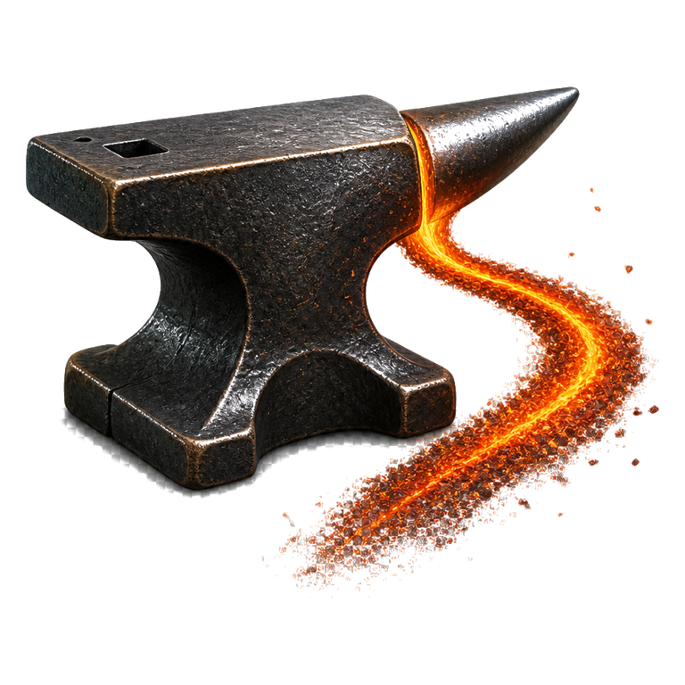

<p align="center">
  
</p>

# ForgeTrail

[](LICENSE)
[](https://www.npmjs.com/package/forgetrail)
[](https://www.npmjs.com/package/forgetrail-mcp)

**Forge the path. Keep the trail.**

A persistent development system for building software with AI agents.

**Docs:** [forgetrail.dev/docs](https://forgetrail.dev/docs) · **Site:** [forgetrail.dev](https://forgetrail.dev)

## Install

Node.js 20+. Prefer `pnpm dlx` on Windows.

```bash
pnpm dlx forgetrail install --lite --with-genesis-stub
```

or `npx forgetrail install --lite --with-genesis-stub`. MCP: `npx -y forgetrail-mcp` (set `FORGETRAIL_ROOT`). Do not add `forgetrail` to an app's `dependencies`.

## Quick start

1. Write a `docs/GENESIS.md` (what, not how) in a **new empty project folder**.
2. Add Lite: the command above, or copy [`content/FORGETRAIL_LITE.md`](content/FORGETRAIL_LITE.md) to `.forgetrail/FORGETRAIL_LITE.md`.
3. Paste the kickoff line from [TRY_FORGETRAIL.md](TRY_FORGETRAIL.md). Approve the Phase 1 brief before any scaffold.

No Node required if you copy Lite by hand. Full recipe: [Try](https://forgetrail.dev/docs/try).

## What you get

A 7-phase playbook, a live `.forgetrail/workflow_tracking.json`, and templates pre-loaded with production lessons. Each project leaves a trail of decisions, gotchas, and breadcrumbs that future work follows. Flags, MCP, and the phase table live in the [docs](https://forgetrail.dev/docs).

## Development

```bash
pnpm --dir mcp-server install
pnpm run mcp:build
pnpm site:dev
```

Site (FilePress + docs mount): `pnpm ship`.

Apache-2.0 · [Catalyst Forge LLC](https://catalystforge.com)
